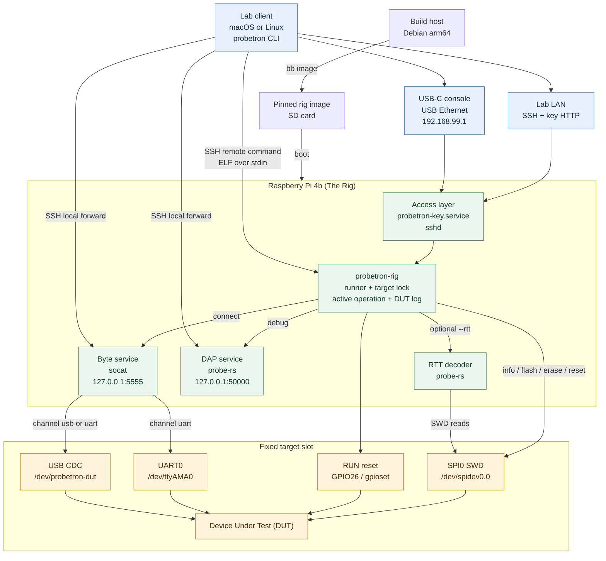

# Probetron

Use a Raspberry Pi 4b over the network to:

- flash/debug an ARM microcontroller via SWDIO
- forward USB serial and UART over TCP

## Disclaimer

I vibe-coded this project so I could give a sandboxed LLM agent access to embedded hardware for it to iterate against.
For more details, see [my newsletter writeup](https://kevinlynagh.com/newsletter/2026_09_task_workflow/#probetron).

I have not really looked at the code much at all.
I have black-box validated that it works to flash:

- a pico2w (rp2350) breakout board
- a blue pill stm32f103 breakout board

using the probetron client from both MacOS and Debian Linux.

I have also used the `probetron connect` functionality (described below).

By design, probetron is **completely insecure** and can be accessed without credentials by anyone on the network.

I'm open to discussing issues, features, and pull requests **with humans**.

I've written this entire README myself.
Peep the commit history if you want to read the Opus-generated slop, though naming it genuinely, the code is load-bearing and it's worth talking about.
(Honestly, have an LLM do it --- smells pretty Claude-ish in there.)

To better convince you this is a real, working thing, here's a photo:


You can tell from the Wago 221s that I'm a Serious Professional.


## Architecture

LLM-generated, correct as far as I can tell architecture diagram:



## Setup

You'll need:

- a Raspberry Pi 4b, henceforth referred to as "The Rig"
- Your Computer, where you will be running the `probetron` client
- a Serial Wire Debug (SWD) microcontroller to flash/debug, the "Device Under Test" (DUT).

If you're the kind of person who understands what this project is for, you probably have a Raspberry Pi 4b in a drawer nearby.
Maybe this code is easy to get working on another single board computer, who knows?
I mostly vibe-coded this, so we're both learning how this thing works together buddy.

To install:

1. Install [babashka](https://github.com/babashka/babashka).
2. Put this repo's `/bin/` on your `PATH`.

If you want to do development (run the tests/formatter), use [Mise](https://mise.jdx.dev/) to install the necessary dependencies.

Then start up an aarch64 Linux VM (if you're on Mac, you can use [Vibe](https://github.com/lynaghk/vibe/)) and run:

    bb image
    
to build the system image for the Raspberry Pi.
Everything will be downloaded and baked into this image, which means the rig doesn't ever need to have an Internet connection.

Then insert a microSD card into Your Computer and, assuming it's a Mac, run `bb flash` for an interactive dialog to help you flash this image.
If you're on Linux, I'll assume you know how to flash a disk image to an SD card using `dd` or something (I'd tell you, but I have no idea).

Then put the microSD card into the Raspberry Pi and boot it up.
Note that this image is mounted *read-only*, so you don't have to worry about disk corruption if you just cut the power on the Raspberry Pi when you're done using it.
Remember: Computers work for us. "Please wait while your computer shuts down" --- they have played us for absolute fools.

I access my rig via ethernet and my router assigns it a static IP and local DNS name, so on my computer I

    export PROBETRON_HOST=my_rig_local_dns_device_name

and this environment variable gets picked up whenever I run `probetron`.
I haven't tried anything with wifi, but if you get that working please open a pull request.

If you connect the rig to your computer via a USB-C cable, it will appear as a network device at 192.168.99.1, and you can log into it by running

    probetron shell --usb

(You may need to have your computer assign itself an IP like 192.168.99.100 first.)


## Wiring

Probetron uses the Raspberry Pi's SPI peripheral to drive the DUT's SWDIO.
Wire things up like this:

| Pi pin                    | DUT pin         |
|---------------------------|-----------------|
| 23                        | SWCLK           |
| 19                        | 1 kΩ  ->  SWDIO |
| 21                        | SWDIO           |
| 37                        | RUN (RESET)     |
| 20 (or any other GND pin) | GND             |


See [pinout.xyz](https://pinout.xyz/) for a nice picture; you can probably also use the Pi's 5V and 3.3V pins to power the DUT assuming you're not drawing tons of current.
The 1kΩ resistor limits the current if the Pi and DUT accidentally drive opposite levels on the SWDIO pin simultaniously.

If your DUT communicates over USB serial, connect it to the Raspberry Pi.
If your DUT communicates over UART, connect:

| Pi pin        | DUT pin |
|---------------|---------|
| 8 (UART0 TX)  | RX      |
| 10 (UART0 RX) | TX      |


## Operations

Once you've got everything wired up, run

    probetron info
    
and, if everything is working, you should see some output like:

    client probetron: 0.1.0
    client babashka: 1.13.219
    client key: /Users/dev/.cache/probetron/keys/probetron.key
    probetron rig running: sudo -n /usr/local/sbin/probetron-rig info --speed-khz 1000 --format text
    probetron: 0.1.0 (b20c0a1, 2026-08-29T13:19:51Z)
    babashka: 1.13.219
    probe-rs: probe-rs 0.32.0 (git commit: v0.32.0-1-g7d8b242e)
    os: Debian GNU/Linux 13 (trixie)
    hostname: probetron
    machine-id: 7eda63636e6b492c9ee34e4df9d8e919
    probe: 0:0:/dev/spidev0.0 swd
    target:
      Probing target via SWD
      ----------------------

      ARM Chip with debug port Default:

      Debug Port: DPv3, MINDP, Designer: ARM Ltd
      ├── 0x2000 Memory Access Port v2 (Coresight Component)
      │   ├── 0xe00ff000 ROM Table (Class 1), Designer: ARM Ltd
      │   ├── 0xe000e000 Processor debug architecture (ARMv8-M) (Coresight Component)
      │   │   └── CPUID
      │   │       ├── IMPLEMENTER: ARM Ltd
      │   │       ├── VARIANT: 1
      │   │       ├── PARTNO: Cortex-M33
      │   │       └── REVISION: 0
      ...

(This is from a Pico 2W.)

Here's the output of `probetron help`:

    Usage:
      probetron info    --host <host> [--speed-khz <speed>] [--format <text|edn>]
      probetron status  --host <host> [--format <text|edn>]
      probetron log     --host <host>
      probetron flash   --host <host> --chip <chip> [--speed-khz <speed>] <elf>
      probetron erase   --host <host> --chip <chip> [--speed-khz <speed>]
      probetron reset   --host <host>
      probetron connect --host <host> --channel <usb|uart> [--baud <baud>] [--usb-wait-seconds <seconds>] [--local-port <port>] [--rtt <elf> --chip <chip> [--speed-khz <speed>]] [--pty] [--reset-on-exit]
      probetron debug   --host <host> [--local-port <port>] [--reset-on-exit]
      probetron shell   --host <host> | --usb

    Environment:
      PROBETRON_HOST              default for --host
      PROBETRON_CHIP              default for --chip
      PROBETRON_SPEED_KHZ         default for --speed-khz (1000)
      PROBETRON_UART_BAUD         default for --baud (115200)
      PROBETRON_USB_WAIT_SECONDS  default for --usb-wait-seconds (10)

Hopefully most of the operations are self-explanatory.

The `connect` subcommand opens either a USB serial or UART connection to the DUT and exposes it on your computer's localhost.

For example, if my DUT exposes a USB serial interface and I have its USB cable plugged into the rig, I can run on my computer:

    $ probetron connect --channel usb
    tcp://127.0.0.1:62698

and then on my computer I can connect to `tcp://127.0.0.1:62698` to communicate directly with the DUT.

Here's the Rust code I use to connect either via probetron (TCP) or via USB (when the DUT is plugged into my computer directly):

```rust
// call this with either "/dev/tty.usbserial12345" OR "tcp://localhost:12345"
fn open_stream(port_name: &str) -> Result<Stream, String> {
    match port_name.strip_prefix("tcp://") {
        Some(address) => open_tcp(address),
        None => open_serial(port_name),
    }
}

fn open_serial(port_name: &str) -> Result<Stream, String> {
    let mut port = serialport::new(port_name, 115_200)
        .timeout(READ_TIMEOUT)
        .open()
        .map_err(|error| error.to_string())?;
    let _ = port.write_data_terminal_ready(true);
    Ok(Stream::Serial(port))
}

fn open_tcp(address: &str) -> Result<Stream, String> {
    let stream = TcpStream::connect(address).map_err(|error| format!("{address}: {error}"))?;
    stream
        .set_nodelay(true)
        .map_err(|error| error.to_string())?;
    stream
        .set_read_timeout(Some(READ_TIMEOUT))
        .map_err(|error| error.to_string())?;
    Ok(Stream::Tcp(stream))
}

enum Stream {
    Serial(Box<dyn SerialPort>),
    Tcp(TcpStream),
}

impl Read for Stream {
    fn read(&mut self, buffer: &mut [u8]) -> std::io::Result<usize> {
        match self {
            Stream::Serial(port) => port.read(buffer),
            Stream::Tcp(stream) => stream.read(buffer),
        }
    }
}

impl Write for Stream {
    fn write(&mut self, buffer: &[u8]) -> std::io::Result<usize> {
        match self {
            Stream::Serial(port) => port.write(buffer),
            Stream::Tcp(stream) => stream.write(buffer),
        }
    }

    fn flush(&mut self) -> std::io::Result<()> {
        match self {
            Stream::Serial(port) => port.flush(),
            Stream::Tcp(stream) => stream.flush(),
        }
    }
}
```


Please let me know if you do anything cool with this.

Congratulations on making it to the end of the README, and have a great day!
