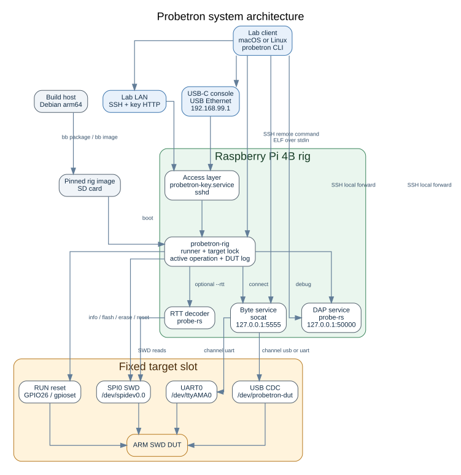
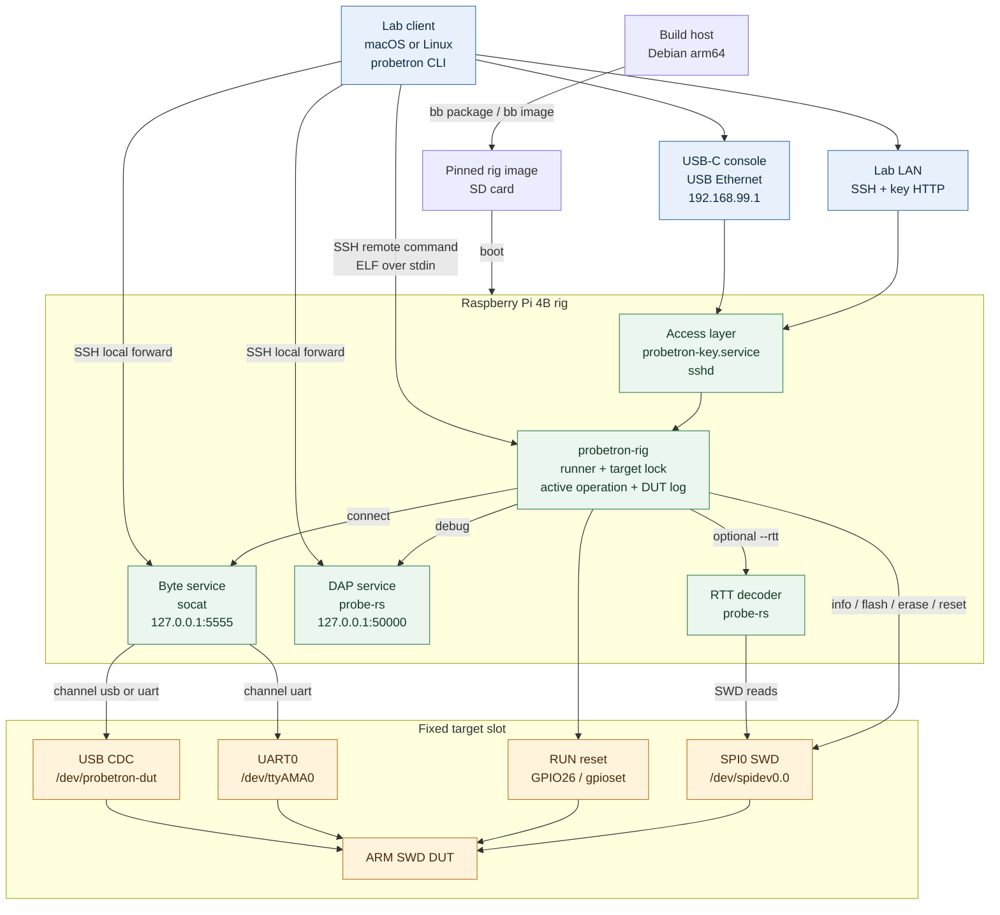

# Probetron architecture

Probetron gives a lab client remote control of one ARM SWD device under test through a Raspberry Pi 4B rig.

The client reaches the rig over SSH on the lab LAN or over the USB-C console link.

The rig locks the target before it starts a short operation or a long-lived service.

The rig exposes long-lived byte and DAP services on loopback only.

## Recommended formats

Use the Mermaid source in a README when the Markdown renderer supports Mermaid.

Use the Graphviz SVG in an HTML or rich-text newsletter.

Use the ASCII version in plain-text email and terminal output.

The Graphviz source keeps the SVG reproducible and gives future edits a stable layout source.

Source files:

- [Mermaid diagram](architecture.mmd)
- [Graphviz source](architecture.dot)
- [Plain-text diagram](architecture.txt)
- [Rendered SVG](architecture.svg)

## Mermaid

## Design notes

Short operations open the target once and return their result over SSH.

Long sessions keep the target lock while the client uses the forwarded byte or DAP service.

The client closing SSH releases the rig-side process groups and target lock.

The USB-C console is an out-of-band path for recovery when the lab LAN is unavailable.

The DUT USB cable carries the optional native USB serial channel and is separate from the rig USB-C console.
